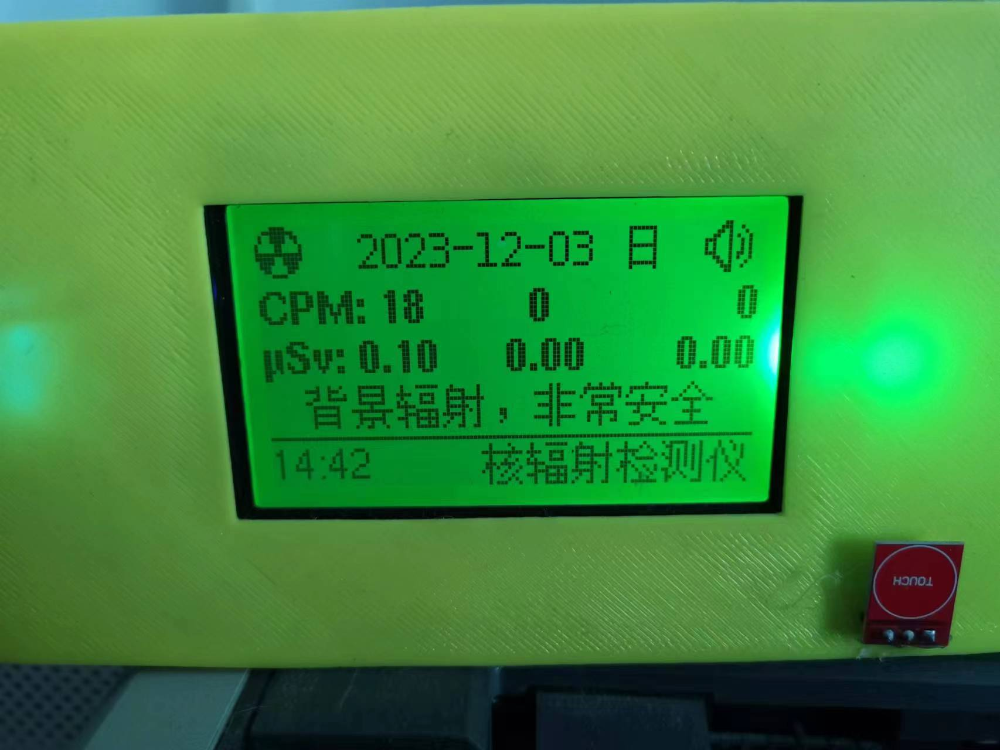
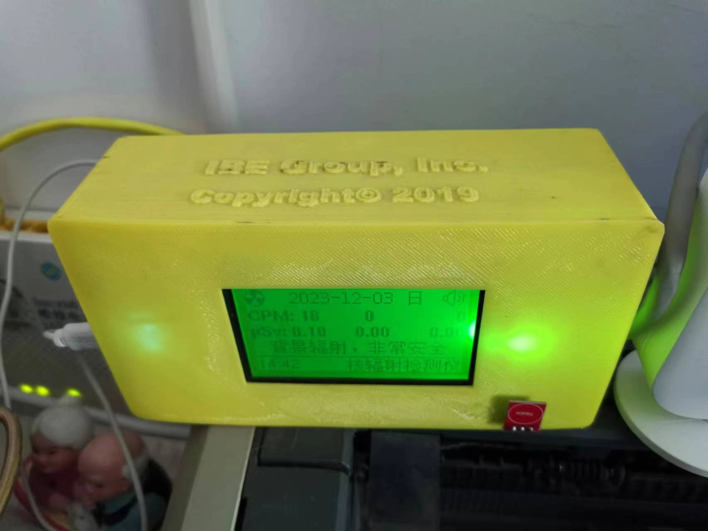
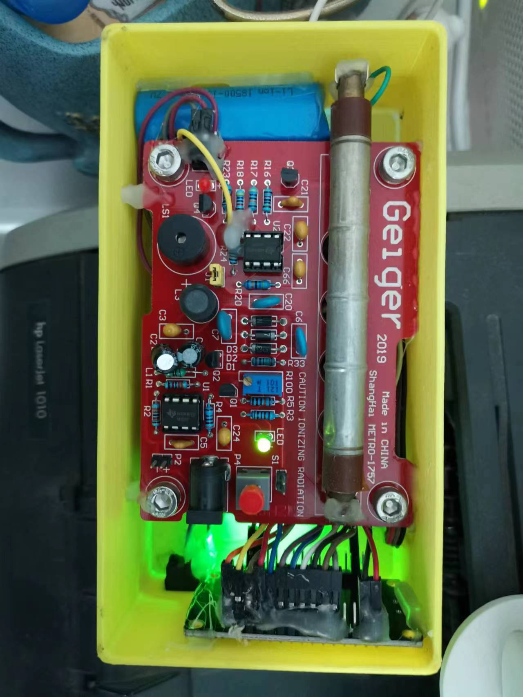

# ESP12-GeigerCounter-SPI-New12864

An ESP-12 (ESP8266) driven Geiger counter display: reads pulses from a Geiger
tube module on an interrupt pin, computes counts-per-minute over three
rolling windows (20s/60s/60s), converts to an estimated dose rate, and shows
it plus a radiation-safety-level message on a 128x64 SPI LCD, alongside a
WiFi-synced clock.

 
 

## Hardware

See [Wiring.txt](Wiring.txt) for pin mappings - it covers three LCD module
variants (the "New 12864" ST7565-family SPI module this sketch targets by
default, plus notes for "Mini 12864" and "Big Blue 12864" variants) and the
button/buzzer/Geiger-pulse pin assignments.

## Setup

1. Install dependencies: `U8g2`, `WiFiManager`, `Timezone`, `JsonStreamingParser`
   (Arduino Library Manager).
2. This sketch depends on `GarfieldCommon.h`/`.cpp`
   ([source](https://github.com/bobhuang1/ESP8266-Garfield-Common)), vendored
   directly into this repo so it builds standalone - **before flashing,
   replace the placeholder WiFi credentials and server addresses in
   `GarfieldCommon.h`/`.cpp` with your own** (see that repo's README for the
   full list and security notes). If you update the shared library, re-copy
   both files here.
3. Flash and power on. With `USE_WIFI_MANAGER` disabled (default), it
   connects using the SSID/password list in `GarfieldCommon.cpp`; enable it
   to instead put up a "ESP8266-Setup" WiFi config portal on first boot.

## Notes

- `#define LANGUAGE_CN` / comment it out to switch the on-screen text between
  Chinese and English.
- The dose-rate-to-safety-level thresholds in `drawLocal()` are rough,
  illustrative bands, not a calibrated radiological safety reference - don't
  rely on this for actual radiation safety decisions.
